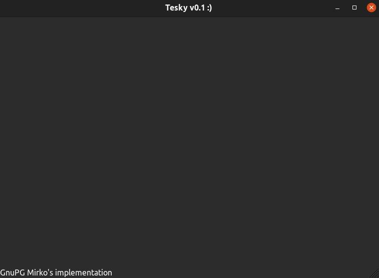

# tesky
GPG key management, encryption/decryption, sign/verify GUI software, based on OpenPGP standard
 finish this!

 
 tesky gpgme zavrsi - ed->grep - EFI programming - LinuxKernelNewbies - customArch - learnChroot 
 UEFI beyond bios - LiveLinuxCD books - Kernel - xv6 - Cryptography in C - RHEL cert

### Verzije:

 
Isto kao kleopatra za windows, na desnom kliku stoji encrypt, gore desno u taskbaru kao telegram stoji otvoren program
 
Kad se otvori isto ima notepad i certificates sekciju, pronadji samo jezik u kom pises
 
A videcu kad ispisem za linux, da ispisem i za Windows u C#, sa nicer GUI-jem
 
OpenGPG and Horowitz Keyserver Protocol
 
https://github.com/gpg/gnupg
 
GUI Framework: WxWidgets -> TaskBarIcon, Clipboard and RightClick
 
Na task bar icon mozes da kliknes SetRecipient, ClEncrypt, ClDecrypt, ClEncryptTo.., ClDecryptFrom.., Encrypt, Decrypt
 
Gde setRecipient postavi nekog od public kljuceva na recipienta, da ne bi morao za svaki ClEncrypt da biras kome saljes
 
ClEncrypt je Clipboard, a obicno Encrypt je da izadje prompt
 
koristi .tgpg direktorijum u home/user direktorijumu
 
pisacu u C++
 
za GPGME lib, u C++ ukljuciti         #include "gpgme.h"   onda imas pristup metodama za poziv enkripcije, umesto sam da implementiras sve

### TODO
- [ ] finished icon taskbar implementation
- [ ] finished clipboard encryption decryption
- [ ] finished right click on file encrypt
- [ ] finished certificate creation and management in application
- [ ] finished notepad part in application
- [ ] finished application design
- [ ] finished making code compileable on windows, *nix and macOS
