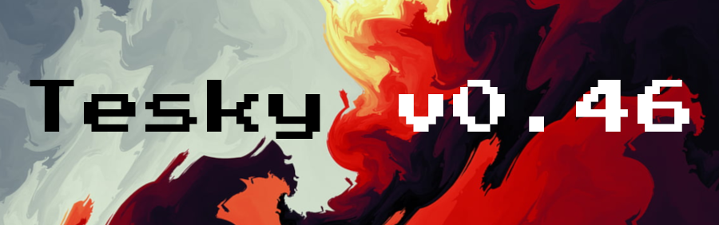
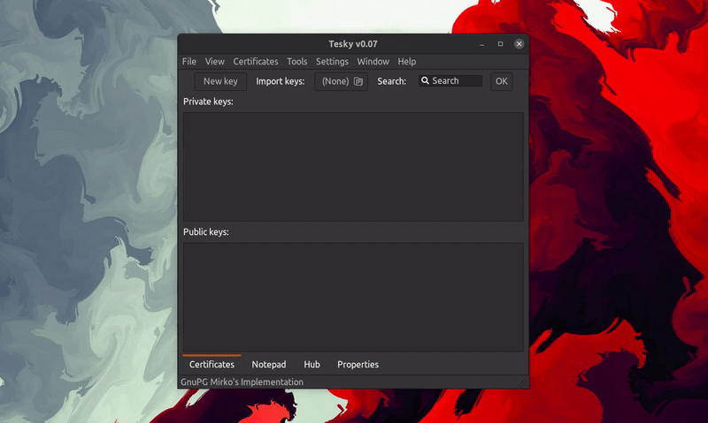
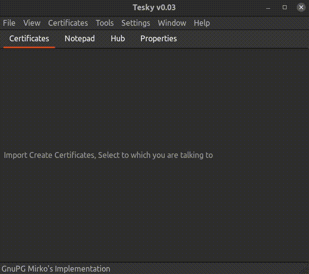
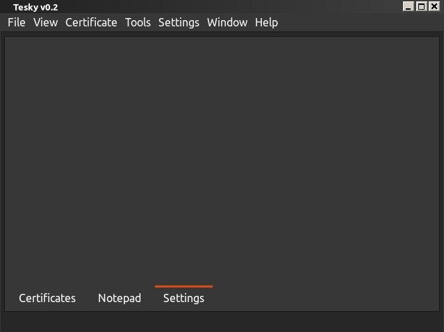
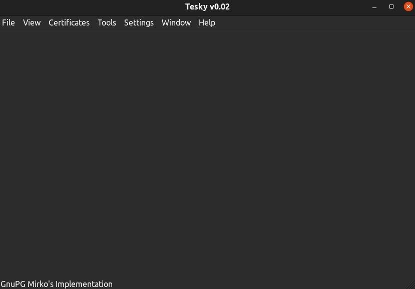

<h1>tesky v0.07</h1>

## About
GPG key management, encryption/decryption, sign/verify GUI software, based on OpenPGP standard
 finish this!

**gpg-tui** is a [Terminal User Interface](https://en.wikipedia.org/wiki/Text-based_user_interface) for [GnuPG](https://gnupg.org/).

It aims to ease the key management operations such as listing/exporting/signing by providing an interface along with the command-line fallback for more complex operations. It is not trying to be a full-fledged interface for _all_ the features that [gpg](https://linux.die.net/man/1/gpg) provides but it tries to bring a more interactive approach to key management.

 
 tesky gpgme zavrsi - ed->grep - EFI programming - LinuxKernelNewbies - customArch - learnChroot - golang/erlang - Haskell - pogledaj Onura Mutlua
 UEFI beyond bios - LiveLinuxCD books - Kernel - xv6 - Cryptography in C - RHCSA->RHCE->RHCA cert

### Verzije:
---
Verzija v0.07 - implemented Cross-Platform optimization 

 
Verzija v0.03 - fully finished GUI 

 
Ideja v0.02.1 - wxformbuilder added za brzi dizajn interfejsa 

 
Verzija v0.02.0 - Began GUI and blueprint 

 

 
Isto kao kleopatra za windows, na desnom kliku stoji encrypt, gore desno u taskbaru kao telegram stoji otvoren program
 
Kad se otvori isto ima notepad i certificates sekciju, pronadji samo jezik u kom pises
 
A videcu kad ispisem za linux, da ispisem i za Windows u C#, sa nicer GUI-jem
 
OpenGPG and Horowitz Keyserver Protocol
 
https://github.com/gpg/gnupg
 
GUI Framework: WxWidgets -> TaskBarIcon, Clipboard and RightClick
 
Na task bar icon mozes da kliknes SetRecipient, ClEncrypt, ClDecrypt, ClEncryptTo.., ClDecryptFrom.., Encrypt, Decrypt
 
Gde setRecipient postavi nekog od public kljuceva na recipienta, da ne bi morao za svaki ClEncrypt da biras kome saljes
 
ClEncrypt je Clipboard, a obicno Encrypt je da izadje prompt
 
koristi .tgpg direktorijum u home/user direktorijumu
 
pisacu u C++
 
za GPGME lib, u C++ ukljuciti         #include "gpgme.h"   onda imas pristup metodama za poziv enkripcije, umesto sam da implementiras sve

### TODO
- [ ] ********PRE-ALPHA version done:
- [x] base design
- [x] menu with apropriate tabs
- [x] fix sizer alignment in Hub tab
- [x] blueprint for GUI
- [ ] Fix code structure -> Header -> aarch.h <- aarch.cpp PROBLEM
- [x] clipboard manipulation
- [ ] gpgme.h implementation
- [ ] Napravi linked listu za kljuceve
- [ ] certificate creation and management
- [x] Enable gpgme.h library
- [ ] Add functionalities to all buttons
- [x] Enable Clipboard
- [ ] Enable system tray icon, na desni klik clipboard en/dec
- [ ] Right Click enc/dec files ili ako je txt file samo dec to clipbrd
- [ ] Make .tesky in ~/.tesky directory path linux
- [ ] Make .tesky in documents in Windows
- [ ] Notepad osmisliti kako i da ubacis da moze odmah u clipboard (dugme za back to clipboard ili encrypt clipboard...)
- [ ] osmisliti da na pokretanju programa on analizira .tesky i kreira linked listu ili array, pa popuni wxString u notepadu pre wxChoice
- [ ] Properties -> add ASCII ARMOR checkbox
- [ ] Properties -> add Crypto choice list
- [ ] Properties -> add HASH choice list
- [ ] Fix color problem na linuxu kad promene system theme
- [ ] ********ALPHA version done:
- [ ] Certificates tab
- [ ] Notepad tab
- [ ] Hub tab
- [ ] system tray icon taskbar - NOT WORKING
- [ ] ???????? right click on file encrypt
- [x] design for alpha version
- [ ] ********BETA version done:
- [x] making code compileable on windows, *nix and macOS - https://stackoverflow.com/questions/3627127/writing-cross-platform-c-code-windows-linux-and-mac-osx
- [ ] razmisli da za windows predjes na c# i wpf ili ostanes na c++
- [ ] ako odlucis za windows wpf, mozes sve za wx da prebacis u lin dir ili da napravis dva odvojena source code-a
- [ ] razmisli za macOS kako ces, moras da testiras u VM
- [ ] Chat tab
- [ ] Drag&Drop file encryption ?tab?
- [ ] all arguments passed when starting program in terminal
- [ ] tested on Windows10-ja-pera, Windows11-pera, Windows7-ja, MacOS-zl, ArchLin-ja, Fedora-ja, Ubuntu-ja, Debian-ja, PopOS-ja, BSD-ja, Manjaro-ja, Mint-ja, Kali-ja, OpenSUSE-ja
- [ ] ********VERSION 1.0.0 STABLE RELEASE done:
- [ ] MDNetwork tab
- [ ] Redesign of the app for WIN, LIN, MACOS
- [ ] publish on aur
- [ ] publish on debian and ubuntu
- [ ] publish on archlinux
- [ ] ********VERSION 2.0.0 FEATURE COMPLETE RELEASE done:
- [ ] PacketEncryptor tab
- [ ] RansomRev tool try to create
- [ ] NAT Traversal - https://bford.info/pub/net/p2pnat/ - https://www.it.lut.fi/wiki/lib/exe/fetch.php/courses/ct30a6900/p2p_over_nat.pdf - https://en.wikipedia.org/wiki/NAT_traversal
- [ ] notepad nek ima real time enkripciju https://youtu.be/BW_B6Zadsj4
- [ ] program koji pokrenes i kriptuje ti automatski data delove paketa i dekriptuje automatski sa odgovarajucim public keyovima, kliknes dva puta i on krene, mozes da izaberes sta ces da kriptujes i onaj sa druge strane kompa treba da dekriptuje -> kao wireshark samo upoznat sa paketima i kriptuje ono sto moze drugi korisnik da dekr
- [ ] tesky chat, start - over, kad kliknes over, sacuva se chat sa slikama u folderu posled ji nivo aplikacije bi bio decentralizovani torent, gde bi uneo ip adrese i stvorio mrezu s njima, pa mozete da pristupate jedni drugima
- [ ] Drag&Drop file encryptor and decryptor
- [ ] probaj da osmislis ransomware reversing tool
